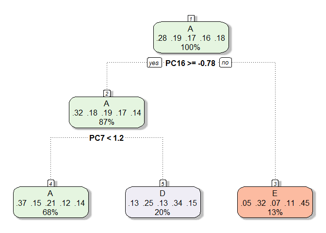

Summary
=======

In this project we construct a prediction model for the manner in which
barbell lift excerise was perfomed by six participants. The manner they
perfomed the experiment was reflected in "classe" variable which was the
outcome of the model while predictors were a series of observations
(features) obtained from accelerometers attached to the arm, forearm and
belt. After some exploratory data analysis various techniques were used
for feature reduction. Subsequently, two different predictor models
(decision tree and random forest) were compared. The accuracy of random
forest model was better, therefore it was used to predict the variable
"classe"" using provided test data.

Obtain the data
===============

The necessary R packages were loaded and test and train data were
downloaded and stored:

    library(caret)
    library(dplyr)
    library(rattle)
    rm(list=ls())
    dir<-getSrcDirectory(function(x) {x})
    setwd(dir)
    fileurl1<-"https://d396qusza40orc.cloudfront.net/predmachlearn/pml-training.csv"
    download.file(fileurl1,destfile="dataset_train_8.csv")
    data_train<-read.csv("dataset_train_8.csv")
    fileurl2<-"https://d396qusza40orc.cloudfront.net/predmachlearn/pml-testing.csv"
    download.file(fileurl2,destfile="dataset_test_8.csv")
    data_test<-read.csv("dataset_test_8.csv")

Exploratory data analysis
=========================

A simple exploratory analysis of training data was carried on. The
structure of the training data and the levels of outcome variable
"classe" were investigated:

    str(data_train)

    ## 'data.frame':    19622 obs. of  160 variables:
    ##  $ X                       : int  1 2 3 4 5 6 7 8 9 10 ...
    ##  $ user_name               : Factor w/ 6 levels "adelmo","carlitos",..: 2 2 2 2 2 2 2 2 2 2 ...
    ##  $ raw_timestamp_part_1    : int  1323084231 1323084231 1323084231 1323084232 1323084232 1323084232 1323084232 1323084232 1323084232 1323084232 ...
    ##  $ raw_timestamp_part_2    : int  788290 808298 820366 120339 196328 304277 368296 440390 484323 484434 ...
    ##  $ cvtd_timestamp          : Factor w/ 20 levels "02/12/2011 13:32",..: 9 9 9 9 9 9 9 9 9 9 ...
    ##  $ new_window              : Factor w/ 2 levels "no","yes": 1 1 1 1 1 1 1 1 1 1 ...
    ##  $ num_window              : int  11 11 11 12 12 12 12 12 12 12 ...
    ##  $ roll_belt               : num  1.41 1.41 1.42 1.48 1.48 1.45 1.42 1.42 1.43 1.45 ...
    ##  $ pitch_belt              : num  8.07 8.07 8.07 8.05 8.07 8.06 8.09 8.13 8.16 8.17 ...
    ##  $ yaw_belt                : num  -94.4 -94.4 -94.4 -94.4 -94.4 -94.4 -94.4 -94.4 -94.4 -94.4 ...
    ##  $ total_accel_belt        : int  3 3 3 3 3 3 3 3 3 3 ...
    ##  $ kurtosis_roll_belt      : Factor w/ 397 levels "","-0.016850",..: 1 1 1 1 1 1 1 1 1 1 ...
    ##  $ kurtosis_picth_belt     : Factor w/ 317 levels "","-0.021887",..: 1 1 1 1 1 1 1 1 1 1 ...
    ##  $ kurtosis_yaw_belt       : Factor w/ 2 levels "","#DIV/0!": 1 1 1 1 1 1 1 1 1 1 ...
    ##  $ skewness_roll_belt      : Factor w/ 395 levels "","-0.003095",..: 1 1 1 1 1 1 1 1 1 1 ...
    ##  $ skewness_roll_belt.1    : Factor w/ 338 levels "","-0.005928",..: 1 1 1 1 1 1 1 1 1 1 ...
    ##  $ skewness_yaw_belt       : Factor w/ 2 levels "","#DIV/0!": 1 1 1 1 1 1 1 1 1 1 ...
    ##  $ max_roll_belt           : num  NA NA NA NA NA NA NA NA NA NA ...
    ##  $ max_picth_belt          : int  NA NA NA NA NA NA NA NA NA NA ...
    ##  $ max_yaw_belt            : Factor w/ 68 levels "","-0.1","-0.2",..: 1 1 1 1 1 1 1 1 1 1 ...
    ##  $ min_roll_belt           : num  NA NA NA NA NA NA NA NA NA NA ...
    ##  $ min_pitch_belt          : int  NA NA NA NA NA NA NA NA NA NA ...
    ##  $ min_yaw_belt            : Factor w/ 68 levels "","-0.1","-0.2",..: 1 1 1 1 1 1 1 1 1 1 ...
    ##  $ amplitude_roll_belt     : num  NA NA NA NA NA NA NA NA NA NA ...
    ##  $ amplitude_pitch_belt    : int  NA NA NA NA NA NA NA NA NA NA ...
    ##  $ amplitude_yaw_belt      : Factor w/ 4 levels "","#DIV/0!","0.00",..: 1 1 1 1 1 1 1 1 1 1 ...
    ##  $ var_total_accel_belt    : num  NA NA NA NA NA NA NA NA NA NA ...
    ##  $ avg_roll_belt           : num  NA NA NA NA NA NA NA NA NA NA ...
    ##  $ stddev_roll_belt        : num  NA NA NA NA NA NA NA NA NA NA ...
    ##  $ var_roll_belt           : num  NA NA NA NA NA NA NA NA NA NA ...
    ##  $ avg_pitch_belt          : num  NA NA NA NA NA NA NA NA NA NA ...
    ##  $ stddev_pitch_belt       : num  NA NA NA NA NA NA NA NA NA NA ...
    ##  $ var_pitch_belt          : num  NA NA NA NA NA NA NA NA NA NA ...
    ##  $ avg_yaw_belt            : num  NA NA NA NA NA NA NA NA NA NA ...
    ##  $ stddev_yaw_belt         : num  NA NA NA NA NA NA NA NA NA NA ...
    ##  $ var_yaw_belt            : num  NA NA NA NA NA NA NA NA NA NA ...
    ##  $ gyros_belt_x            : num  0 0.02 0 0.02 0.02 0.02 0.02 0.02 0.02 0.03 ...
    ##  $ gyros_belt_y            : num  0 0 0 0 0.02 0 0 0 0 0 ...
    ##  $ gyros_belt_z            : num  -0.02 -0.02 -0.02 -0.03 -0.02 -0.02 -0.02 -0.02 -0.02 0 ...
    ##  $ accel_belt_x            : int  -21 -22 -20 -22 -21 -21 -22 -22 -20 -21 ...
    ##  $ accel_belt_y            : int  4 4 5 3 2 4 3 4 2 4 ...
    ##  $ accel_belt_z            : int  22 22 23 21 24 21 21 21 24 22 ...
    ##  $ magnet_belt_x           : int  -3 -7 -2 -6 -6 0 -4 -2 1 -3 ...
    ##  $ magnet_belt_y           : int  599 608 600 604 600 603 599 603 602 609 ...
    ##  $ magnet_belt_z           : int  -313 -311 -305 -310 -302 -312 -311 -313 -312 -308 ...
    ##  $ roll_arm                : num  -128 -128 -128 -128 -128 -128 -128 -128 -128 -128 ...
    ##  $ pitch_arm               : num  22.5 22.5 22.5 22.1 22.1 22 21.9 21.8 21.7 21.6 ...
    ##  $ yaw_arm                 : num  -161 -161 -161 -161 -161 -161 -161 -161 -161 -161 ...
    ##  $ total_accel_arm         : int  34 34 34 34 34 34 34 34 34 34 ...
    ##  $ var_accel_arm           : num  NA NA NA NA NA NA NA NA NA NA ...
    ##  $ avg_roll_arm            : num  NA NA NA NA NA NA NA NA NA NA ...
    ##  $ stddev_roll_arm         : num  NA NA NA NA NA NA NA NA NA NA ...
    ##  $ var_roll_arm            : num  NA NA NA NA NA NA NA NA NA NA ...
    ##  $ avg_pitch_arm           : num  NA NA NA NA NA NA NA NA NA NA ...
    ##  $ stddev_pitch_arm        : num  NA NA NA NA NA NA NA NA NA NA ...
    ##  $ var_pitch_arm           : num  NA NA NA NA NA NA NA NA NA NA ...
    ##  $ avg_yaw_arm             : num  NA NA NA NA NA NA NA NA NA NA ...
    ##  $ stddev_yaw_arm          : num  NA NA NA NA NA NA NA NA NA NA ...
    ##  $ var_yaw_arm             : num  NA NA NA NA NA NA NA NA NA NA ...
    ##  $ gyros_arm_x             : num  0 0.02 0.02 0.02 0 0.02 0 0.02 0.02 0.02 ...
    ##  $ gyros_arm_y             : num  0 -0.02 -0.02 -0.03 -0.03 -0.03 -0.03 -0.02 -0.03 -0.03 ...
    ##  $ gyros_arm_z             : num  -0.02 -0.02 -0.02 0.02 0 0 0 0 -0.02 -0.02 ...
    ##  $ accel_arm_x             : int  -288 -290 -289 -289 -289 -289 -289 -289 -288 -288 ...
    ##  $ accel_arm_y             : int  109 110 110 111 111 111 111 111 109 110 ...
    ##  $ accel_arm_z             : int  -123 -125 -126 -123 -123 -122 -125 -124 -122 -124 ...
    ##  $ magnet_arm_x            : int  -368 -369 -368 -372 -374 -369 -373 -372 -369 -376 ...
    ##  $ magnet_arm_y            : int  337 337 344 344 337 342 336 338 341 334 ...
    ##  $ magnet_arm_z            : int  516 513 513 512 506 513 509 510 518 516 ...
    ##  $ kurtosis_roll_arm       : Factor w/ 330 levels "","-0.02438",..: 1 1 1 1 1 1 1 1 1 1 ...
    ##  $ kurtosis_picth_arm      : Factor w/ 328 levels "","-0.00484",..: 1 1 1 1 1 1 1 1 1 1 ...
    ##  $ kurtosis_yaw_arm        : Factor w/ 395 levels "","-0.01548",..: 1 1 1 1 1 1 1 1 1 1 ...
    ##  $ skewness_roll_arm       : Factor w/ 331 levels "","-0.00051",..: 1 1 1 1 1 1 1 1 1 1 ...
    ##  $ skewness_pitch_arm      : Factor w/ 328 levels "","-0.00184",..: 1 1 1 1 1 1 1 1 1 1 ...
    ##  $ skewness_yaw_arm        : Factor w/ 395 levels "","-0.00311",..: 1 1 1 1 1 1 1 1 1 1 ...
    ##  $ max_roll_arm            : num  NA NA NA NA NA NA NA NA NA NA ...
    ##  $ max_picth_arm           : num  NA NA NA NA NA NA NA NA NA NA ...
    ##  $ max_yaw_arm             : int  NA NA NA NA NA NA NA NA NA NA ...
    ##  $ min_roll_arm            : num  NA NA NA NA NA NA NA NA NA NA ...
    ##  $ min_pitch_arm           : num  NA NA NA NA NA NA NA NA NA NA ...
    ##  $ min_yaw_arm             : int  NA NA NA NA NA NA NA NA NA NA ...
    ##  $ amplitude_roll_arm      : num  NA NA NA NA NA NA NA NA NA NA ...
    ##  $ amplitude_pitch_arm     : num  NA NA NA NA NA NA NA NA NA NA ...
    ##  $ amplitude_yaw_arm       : int  NA NA NA NA NA NA NA NA NA NA ...
    ##  $ roll_dumbbell           : num  13.1 13.1 12.9 13.4 13.4 ...
    ##  $ pitch_dumbbell          : num  -70.5 -70.6 -70.3 -70.4 -70.4 ...
    ##  $ yaw_dumbbell            : num  -84.9 -84.7 -85.1 -84.9 -84.9 ...
    ##  $ kurtosis_roll_dumbbell  : Factor w/ 398 levels "","-0.0035","-0.0073",..: 1 1 1 1 1 1 1 1 1 1 ...
    ##  $ kurtosis_picth_dumbbell : Factor w/ 401 levels "","-0.0163","-0.0233",..: 1 1 1 1 1 1 1 1 1 1 ...
    ##  $ kurtosis_yaw_dumbbell   : Factor w/ 2 levels "","#DIV/0!": 1 1 1 1 1 1 1 1 1 1 ...
    ##  $ skewness_roll_dumbbell  : Factor w/ 401 levels "","-0.0082","-0.0096",..: 1 1 1 1 1 1 1 1 1 1 ...
    ##  $ skewness_pitch_dumbbell : Factor w/ 402 levels "","-0.0053","-0.0084",..: 1 1 1 1 1 1 1 1 1 1 ...
    ##  $ skewness_yaw_dumbbell   : Factor w/ 2 levels "","#DIV/0!": 1 1 1 1 1 1 1 1 1 1 ...
    ##  $ max_roll_dumbbell       : num  NA NA NA NA NA NA NA NA NA NA ...
    ##  $ max_picth_dumbbell      : num  NA NA NA NA NA NA NA NA NA NA ...
    ##  $ max_yaw_dumbbell        : Factor w/ 73 levels "","-0.1","-0.2",..: 1 1 1 1 1 1 1 1 1 1 ...
    ##  $ min_roll_dumbbell       : num  NA NA NA NA NA NA NA NA NA NA ...
    ##  $ min_pitch_dumbbell      : num  NA NA NA NA NA NA NA NA NA NA ...
    ##  $ min_yaw_dumbbell        : Factor w/ 73 levels "","-0.1","-0.2",..: 1 1 1 1 1 1 1 1 1 1 ...
    ##  $ amplitude_roll_dumbbell : num  NA NA NA NA NA NA NA NA NA NA ...
    ##   [list output truncated]

    table(data_train$classe)

    ## 
    ##    A    B    C    D    E 
    ## 5580 3797 3422 3216 3607

it could be seen that there were 160 features in the data and there were
19622 observations. Furthermore it could be observed that the data had
"NA" entries, one could also observe that the "classe" variable could
take five different levels "A" to "E".

Feature reduction and data partitioning
=======================================

Four different approaches were used to reduce the number of features in
the train data set used for the prediction: first the features for which
more than half of the entries were missing were excluded. All these
approaches were also applied to the test data.

    na_indices<-which(colSums(is.na(data_train))>=10000)
    data_train=data_train[,-na_indices]
    data_test=data_test[,-na_indices]
    table(is.na(data_train))

    ## 
    ##   FALSE 
    ## 1824846

It could be seen that this approach removed all NA entries and there was
no need for imputation. In the second feature reduction approach the
features that were irrelevant to the prediction like time stamps,
indices and participant's names were excluded:

    data_train=data_train[,-c(1:5)]#contain name, index, and time stamp
    data_test=data_test[,-c(1:5)]

In the third approach the features with near zero variance were removed
as these features were not expected to contribute much to the predicted
outcome:

    nzv_index<-nearZeroVar(data_train)
    data_train<-data_train[,-nzv_index]
    data_test<-data_test[,-nzv_index]

The train data was then partitioned to training and validation data so
that one could compare the performance of fitted models on the train
data before applying the more accurate model to the test data.

    set.seed(111)
    inTrain<-createDataPartition(y=data_train$classe,p=0.7,list=FALSE)
    train_set<-data_train[inTrain,]
    valid_set<-data_train[-inTrain,]

Subsequently the forth feature reduction approach was conducted: The PCA
analysis was performed on the remaing features to identify the ones that
capture 90% of variations. The cumulative effect of all these four
feature reduction approaches was a reduction of number of predictors
(features) from 160 to 21.

    a<-which(names(data_train)=='classe')
    pca_preproc<-preProcess(train_set[,-a],method="pca",thres=.9)
    train_pc<-predict(pca_preproc,train_set[,-a])#have to do the same to test and validate
    valid_pc<-predict(pca_preproc,valid_set[,-a])
    test_pc<-predict(pca_preproc,data_test[,-a])

Fitting models
==============

Two different prediction models were chosen, a decision tree model and a
random forest model for the sake of comparison. The random forest model
was chosen as it is one of the top choices for machine learning
applications due to its high accuracy. For both models a 10 fold
crossvalidation was also performed:

    train_control<-trainControl('cv',10)
    system.time(tree_model<-train(y=train_set$classe,x=train_pc,trControl=train_control,method="rpart"))

    ##    user  system elapsed 
    ##    6.88    0.03    6.91

    system.time(rf_model<-train(y=train_set$classe,x=train_pc,trControl=train_control,method="rf"))

    ##    user  system elapsed 
    ##  676.19    5.76  683.19

The tree fitted by decision tree model is shown below:

    fancyRpartPlot(tree_model$finalModel,sub=" ")

Using confusion matrix the accuracy of this decision tree model was
investigated using the validation data set:

    predict_tree<-predict(tree_model,newdata=valid_pc)
    cf_rpart<-confusionMatrix(predict_tree,valid_set$classe)
    acc_rpart<-cf_rpart$overall['Accuracy']
    cf_rpart

    ## Confusion Matrix and Statistics
    ## 
    ##           Reference
    ## Prediction    A    B    C    D    E
    ##          A 1467  610  838  487  531
    ##          B    0    0    0    0    0
    ##          C    0    0    0    0    0
    ##          D  150  292  147  384  190
    ##          E   57  237   41   93  361
    ## 
    ## Overall Statistics
    ##                                           
    ##                Accuracy : 0.3759          
    ##                  95% CI : (0.3635, 0.3884)
    ##     No Information Rate : 0.2845          
    ##     P-Value [Acc > NIR] : < 2.2e-16       
    ##                                           
    ##                   Kappa : 0.171           
    ##  Mcnemar's Test P-Value : NA              
    ## 
    ## Statistics by Class:
    ## 
    ##                      Class: A Class: B Class: C Class: D Class: E
    ## Sensitivity            0.8763   0.0000   0.0000  0.39834  0.33364
    ## Specificity            0.4144   1.0000   1.0000  0.84170  0.91089
    ## Pos Pred Value         0.3730      NaN      NaN  0.33018  0.45754
    ## Neg Pred Value         0.8940   0.8065   0.8257  0.87717  0.85852
    ## Prevalence             0.2845   0.1935   0.1743  0.16381  0.18386
    ## Detection Rate         0.2493   0.0000   0.0000  0.06525  0.06134
    ## Detection Prevalence   0.6683   0.0000   0.0000  0.19762  0.13407
    ## Balanced Accuracy      0.6454   0.5000   0.5000  0.62002  0.62227

which provided the accuracy of 0.3758709. Using confusion matrix the
accuracy of random forest model was also investigated using the
validation data set:

    predict_rf<-predict(rf_model,newdata=valid_pc)
    cf_rf<-confusionMatrix(predict_rf,valid_set$classe)
    cf_rf

    ## Confusion Matrix and Statistics
    ## 
    ##           Reference
    ## Prediction    A    B    C    D    E
    ##          A 1656   18    4    0    0
    ##          B    1 1102    9    0    1
    ##          C    6   14  999   44    1
    ##          D   10    0    9  920   10
    ##          E    1    5    5    0 1070
    ## 
    ## Overall Statistics
    ##                                           
    ##                Accuracy : 0.9766          
    ##                  95% CI : (0.9724, 0.9803)
    ##     No Information Rate : 0.2845          
    ##     P-Value [Acc > NIR] : < 2.2e-16       
    ##                                           
    ##                   Kappa : 0.9703          
    ##  Mcnemar's Test P-Value : NA              
    ## 
    ## Statistics by Class:
    ## 
    ##                      Class: A Class: B Class: C Class: D Class: E
    ## Sensitivity            0.9892   0.9675   0.9737   0.9544   0.9889
    ## Specificity            0.9948   0.9977   0.9866   0.9941   0.9977
    ## Pos Pred Value         0.9869   0.9901   0.9389   0.9694   0.9898
    ## Neg Pred Value         0.9957   0.9922   0.9944   0.9911   0.9975
    ## Prevalence             0.2845   0.1935   0.1743   0.1638   0.1839
    ## Detection Rate         0.2814   0.1873   0.1698   0.1563   0.1818
    ## Detection Prevalence   0.2851   0.1891   0.1808   0.1613   0.1837
    ## Balanced Accuracy      0.9920   0.9826   0.9802   0.9742   0.9933

    cf_rf_acc<-cf_rf$overall['Accuracy']

which provided the accuracy of 0.9765506. It can be seen that as
expected the accuracy of random forest model is much higher therefore we
use this model to predict the oucome from the provided test data.

Predict the outcomes for the test data
======================================

The random forest model was used to predict the outcomes for the test
data. The predicted outcomes were written to a text file:

    predict_test<-predict(rf_model,newdata=test_pc)
    out<-data.frame(test=1:20,prediction=predict_test)
    write.table(out,"output.txt",sep="\t",row.names=FALSE)
